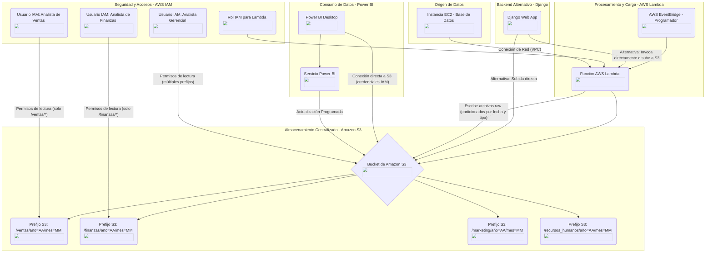

# Diagrama AWS

```mermaid

graph TD
    subgraph Origen de Datos
        DB[Instancia EC2 - Base de Datos <img src='https://miro.medium.com/v2/resize:fit:720/format:webp/1*Sk7m2to8qv-N-hMII4T5jw.png' width='40' height='40'>]
    end

    subgraph Backend Alternativo - Django
        D(Django Web App <img src='https://static.djangoproject.com/img/logos/django-logo-positive.png' width='40' height='40'>)
    end

    subgraph Procesamiento y Carga - AWS Lambda
        EB(AWS EventBridge - Programador <img src='https://miro.medium.com/v2/resize:fit:720/format:webp/0*dHGtcVLJa79yHt2v.png' width='40' height='40'>)
        EB --> L
        D -- Alternativa: Invoca directamente o sube a S3 --> L(Función AWS Lambda <img src='https://www.unimedia.tech/wp-content/uploads/2023/11/AWS-Lambda-e1701195645609-1024x359.png' width='40' height='40'>)
    end

    subgraph Almacenamiento Centralizado - Amazon S3
        L --> S3_Bucket{Bucket de Amazon S3 <img src='https://www.dmuth.org/wp-content/uploads/2019/09/aws-s3-icon.png' width='40' height='40'>}
        D -- Alternativa: Subida directa --> S3_Bucket
        S3_Bucket --> S3_Ventas(Prefijo S3: /ventas/año=AA/mes=MM <img src='https://conn-afd-prod-endpoint-bmc9bqahasf3grgk.b01.azurefd.net/releases/v1.0.1747/1.0.1748.4181/amazons3/icon.png' width='30' height='30'>)
        S3_Bucket --> S3_Finanzas(Prefijo S3: /finanzas/año=AA/mes=MM <img src='https://conn-afd-prod-endpoint-bmc9bqahasf3grgk.b01.azurefd.net/releases/v1.0.1747/1.0.1748.4181/amazons3/icon.png' width='30' height='30'>)
        S3_Bucket --> S3_Marketing(Prefijo S3: /marketing/año=AA/mes=MM <img src='https://conn-afd-prod-endpoint-bmc9bqahasf3grgk.b01.azurefd.net/releases/v1.0.1747/1.0.1748.4181/amazons3/icon.png' width='30' height='30'>)
        S3_Bucket --> S3_RRHH(Prefijo S3: /recursos_humanos/año=AA/mes=MM <img src='https://conn-afd-prod-endpoint-bmc9bqahasf3grgk.b01.azurefd.net/releases/v1.0.1747/1.0.1748.4181/amazons3/icon.png' width='30' height='30'>)
    end

    subgraph Consumo de Datos - Power BI
        PBI_Desktop[Power BI Desktop <img src='https://images.seeklogo.com/logo-png/40/1/power-bi-microsoft-logo-png_seeklogo-400711.png' width='40' height='40'>] --> PBI_Service(Servicio Power BI <img src='https://exceleratorbi.com.au/wp-content/uploads/2017/04/power-bi-Service.png' width='40' height='40'>)
    end

    subgraph Seguridad y Accesos - AWS IAM
        IAM_Role_Lambda(Rol IAM para Lambda <img src='https://res.cloudinary.com/hy4kyit2a/f_auto,fl_lossy,q_70/learn/modules/aws-cloud-security/control-access-with-aws-identity-and-access-management/images/59fe17d20802f8ab6599b6d17268e9f8_8-d-39-d-9-a-8-59-ee-45-a-0-a-49-e-6820-b-64-cd-7-d-5.png' width='40' height='40'>) --> L
        IAM_User_Analista_Ventas(Usuario IAM: Analista de Ventas <img src='https://res.cloudinary.com/hy4kyit2a/f_auto,fl_lossy,q_70/learn/modules/aws-cloud-security/control-access-with-aws-identity-and-access-management/images/3be5110403def7a454eba4b3d1b0149b_539-fba-7-a-c-7-fb-4613-9-a-6-a-7259486-dc-547.png' width='40' height='40'>)
        IAM_User_Analista_Finanzas(Usuario IAM: Analista de Finanzas <img src='https://res.cloudinary.com/hy4kyit2a/f_auto,fl_lossy,q_70/learn/modules/aws-cloud-security/control-access-with-aws-identity-and-access-management/images/3be5110403def7a454eba4b3d1b0149b_539-fba-7-a-c-7-fb-4613-9-a-6-a-7259486-dc-547.png' width='40' height='40'>)
        IAM_User_Analista_Gerencial(Usuario IAM: Analista Gerencial <img src='https://res.cloudinary.com/hy4kyit2a/f_auto,fl_lossy,q_70/learn/modules/aws-cloud-security/control-access-with-aws-identity-and-access-management/images/3be5110403def7a454eba4b3d1b0149b_539-fba-7-a-c-7-fb-4613-9-a-6-a-7259486-dc-547.png' width='40' height='40'>)
    end

    DB -- Conexión de Red (VPC) --> L
    L -- Escribe archivos raw (particionados por fecha y tipo) --> S3_Bucket

    PBI_Desktop -- Conexión directa a S3 (credenciales IAM) --> S3_Bucket
    PBI_Service -- Actualización Programada --> S3_Bucket

    IAM_User_Analista_Ventas -- Permisos de lectura (solo /ventas/*) --> S3_Ventas
    IAM_User_Analista_Finanzas -- Permisos de lectura (solo /finanzas/*) --> S3_Finanzas
    IAM_User_Analista_Gerencial -- Permisos de lectura (múltiples prefijos) --> S3_Bucket

```